# Financial Planner — Engineering Handbook

## How to read this
<!-- last-verified: 2026-05-12 -->

This handbook is **reference + explanation** for engineers (including future-self) working on `financial-planner-web`. It is not a tutorial or a how-to-deploy guide; user-facing product scope lives in `README.md`, and operational decisions live in `docs/adr/`.

Four sections:

- **§1 Overview** — one screen of orientation: what the system does, the layered shape, where to start reading.
- **§2 Key Workflows** — every user-triggered flow, grouped by domain. To keep 30+ workflows maintainable, §2.0 defines six **canonical shape diagrams** and each per-domain table cites the shape its workflow follows. Workflows that genuinely differ from every shape get their own full diagram.
- **§3 Technical Design** — cross-cutting concerns. One stable home per concern: auth, RLS, validation, error handling, caching, configuration, observability, testing, type boundaries.
- **§4 C4 Diagrams** — Context, Container, Component views of the current state.

**Freshness contract.** Every `## ` section carries a `<!-- last-verified: YYYY-MM-DD -->` watermark on the line directly below the heading. The `npm run docs:check` script reads these and warns when any is older than 90 days. It also validates every `src/...`, `supabase/...`, and `docs/...` reference in this file — broken references fail CI.

**Decision history vs. current state.** This handbook is the *what* and *how*. The *why* lives in `docs/adr/`. When a non-obvious choice is mentioned here, the inline note "(see ADR)" points at the relevant decision record once one exists.

---

## §1 Overview
<!-- last-verified: 2026-05-13 -->

**What the app does.** A private, single-user financial-planning workspace for the Singapore context. Users record their financial position (income, balances, debt, CPF, housing loans, vehicles), set spending budgets and goals, log expenses, and see forward-looking projections through retirement.

**Top-level shape.** Layered, single-runtime Next.js 16 app on the App Router, backed by hosted Supabase (Postgres + Auth). All authorization is enforced at the database via RLS — there is no service-role key in the app, and there is no separate API service. Domain calculations are pure.

**Two workspaces, one runtime.** Users are either **advisors** (self-serve planners and key issuers) or **clients** (invited via an advisor access key during signup). Both share the codebase and the data model; the difference is enforced by `financial_profiles.profile_type`, the middleware's role-aware redirects, and the `AppShell` workspace prop (`advisor` chrome vs `client` chrome). See §3.1 for the role routing and §3.2 for the RLS that lets advisors read their linked clients' profile rows without exposing other advisors' clients.

```
src/app/                       Next.js App Router — pages, layouts, API route handlers
src/features/                  UI: client + server React components, grouped by domain
src/server/actions.ts          Server actions ("use server") — 27 mutations (client surfaces)
src/server/advisor-access-key-actions.ts        Legacy POC advisor access-key generation — 2 actions
src/server/advisor-key-purchase-actions.ts      Advisor purchase + coupon + phone-sync + contact RPC — 5 actions
src/server/advisor-client-actions.ts            Advisor edit-on-behalf-of-linked-client mutations — 3 actions
src/data/repositories/         Typed Supabase wrappers, one file per table
src/data/{dashboard,budget-summary,projection,...}.ts   Composition layers — aggregate reads + derived shapes
src/data/supabase/{server,browser,types}.ts             Supabase client factories + row types
src/domain/finance/            Pure financial calc (CPF, mortgages, projections); zero I/O; vitest-covered
src/lib/                       Shared utilities: dates, currency, validation (Zod), env
src/ui/                        Design-system primitives + style class constants
src/middleware.ts              Session refresh + onboarding gate
src/content/methodology-topics.ts                       Static methodology copy for help modal
supabase/migrations/           Declarative SQL — tables, RLS policies, triggers
```

**Where to start reading** when joining the codebase:

1. `src/app/(app)/layout.tsx` — the authenticated surface. Reads the user, mounts `AppShell`, sets `force-dynamic`.
2. `src/server/actions.ts` — the primary mutation taxonomy. 27 server actions covering client-side writes that aren't expenses (`/api/expenses`) or profile patches (`/api/profile`). Advisor flows live in three sibling files: `advisor-access-key-actions.ts` (POC key generation), `advisor-key-purchase-actions.ts` (purchase + coupon + phone + contact), and `advisor-client-actions.ts` (edit-on-behalf-of-linked-client).
3. `supabase/migrations/` — the data model and trust boundary. Every table has `user_id = auth.uid()` RLS policies (see §3.2).
4. `src/middleware.ts` — the request-lifecycle perimeter. Refreshes session cookies and gates onboarding.

**Tech stack.** Next.js 16.2.3 (App Router) · TypeScript strict · React 19.2 · Tailwind 4 · Recharts · Zod 4 · Vitest 3 · `@supabase/ssr` 0.10 · `@supabase/supabase-js` 2.103.

**Two env vars.** Both public. `NEXT_PUBLIC_SUPABASE_URL` and `NEXT_PUBLIC_SUPABASE_ANON_KEY`. Validation at startup via `src/lib/env.ts:requireSupabaseEnv`.

---

## §2 Key Workflows
<!-- last-verified: 2026-05-12 -->

This section uses a hybrid pattern to cover every workflow without producing 30+ diagrams to maintain. **§2.0 defines six canonical shapes** — each represents a recurring path through the layers. **§2.1–§2.9** then list every workflow in a per-domain table, each row citing the shape it follows plus its variant deltas (entry symbol, mutation symbol, revalidations, notable branches).

### §2.0 Canonical workflow shapes
<!-- last-verified: 2026-05-13 -->

#### Shape 1 — Server-action CRUD

The default mutation path for everything except expenses and profile updates. Form binds to a server action via `useTransition` (or `useActionState`), which validates the FormData, calls a repository, and revalidates affected paths.

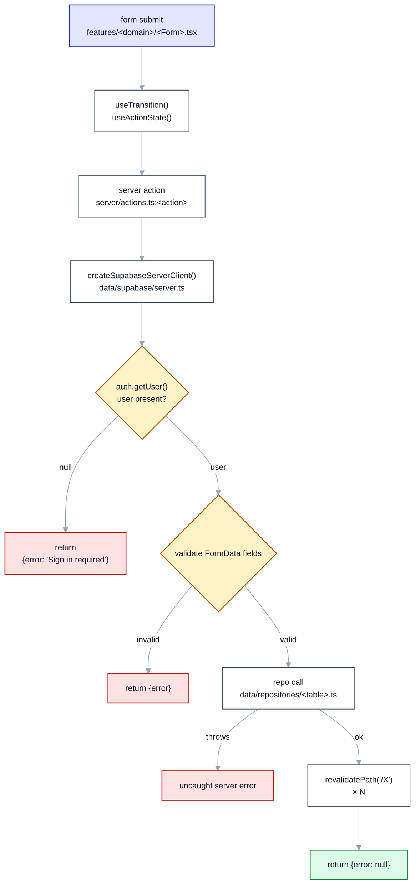

Variants: some actions don't return (they `redirect()` — see Shape 5). Some actions skip the user check intentionally (none currently).

#### Shape 2 — Route-handler mutation with conflict check

Used by the two route handlers that need pre-write business logic that's awkward to embed in a server action: `POST /api/expenses`, `PATCH /api/expenses/[id]`, and `PATCH /api/profile` (which has CPF recalculation). Returns JSON, not action result objects.

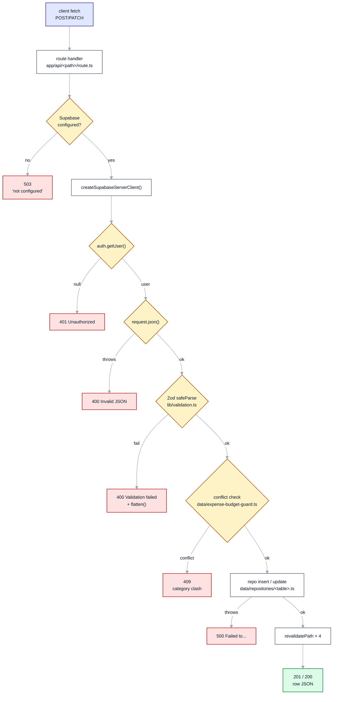

The `hasBudgetCategoryMonthlyConflict` step is specific to expenses; `/api/profile` substitutes CPF recalculation (`annualEmployeeCpfTakeHomeWithBonusSg` in `src/domain/finance/sg-cpf.ts`) for the conflict check.

#### Shape 3 — Server-component page render

How every `(app)/*` page works. Page is a server component, declared `force-dynamic` via the parent layout, fetches its data inline via repositories or composition layers, returns an RSC tree with client islands embedded for interactivity.

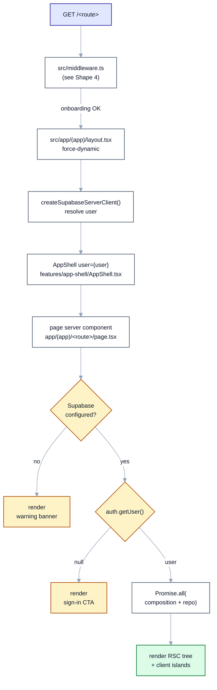

Composition layer examples used at this step: `getDashboardPayload` in `src/data/dashboard.ts`, `getBudgetPageModel` in `src/data/budget-summary.ts`, `isFinancialProfileIncomplete` in `src/data/financial-profile.ts`.

#### Shape 4 — Middleware-gated navigation

Every non-static request flows through `src/middleware.ts`. Three responsibilities: refresh Supabase session cookies, enforce the onboarding gate, and route by role (advisors are pushed onto `/advisor/*`; clients with missing or null `advisor_user_id` are pushed onto `/account-issue`). See §3.1 for the full role-routing matrix and §2.9 for the advisor-side counterpart.

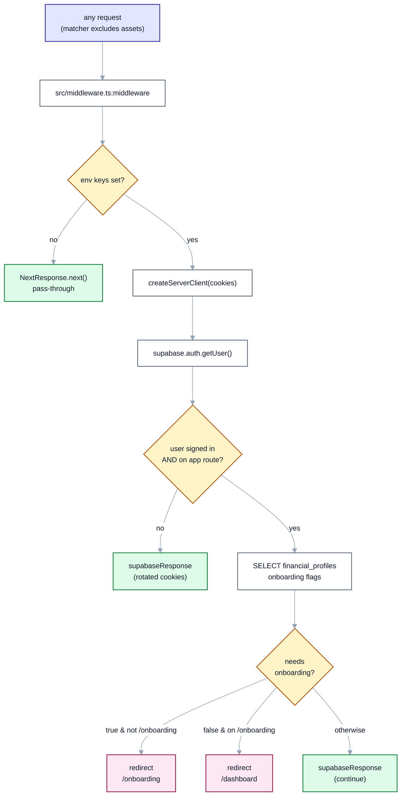

Two route regexes are OR'd into `isGatedAppRoute` (`src/middleware.ts:4–7`): `clientAppRouteRegex` covers `dashboard|home|planning|activity|profile|expenses|spending|budget|setup|balances|goals|financial-profile|onboarding|account-issue`, and `advisorAppRouteRegex` matches any path under `/advisor`. The matcher in `config.matcher` excludes static assets and image files.

#### Shape 5 — Auth lifecycle (signup → email confirm → signin → signout)

Spans three temporal phases connected by user actions. Browser client handles credential exchange; a Postgres trigger creates the profile row; subsequent requests flow through middleware.

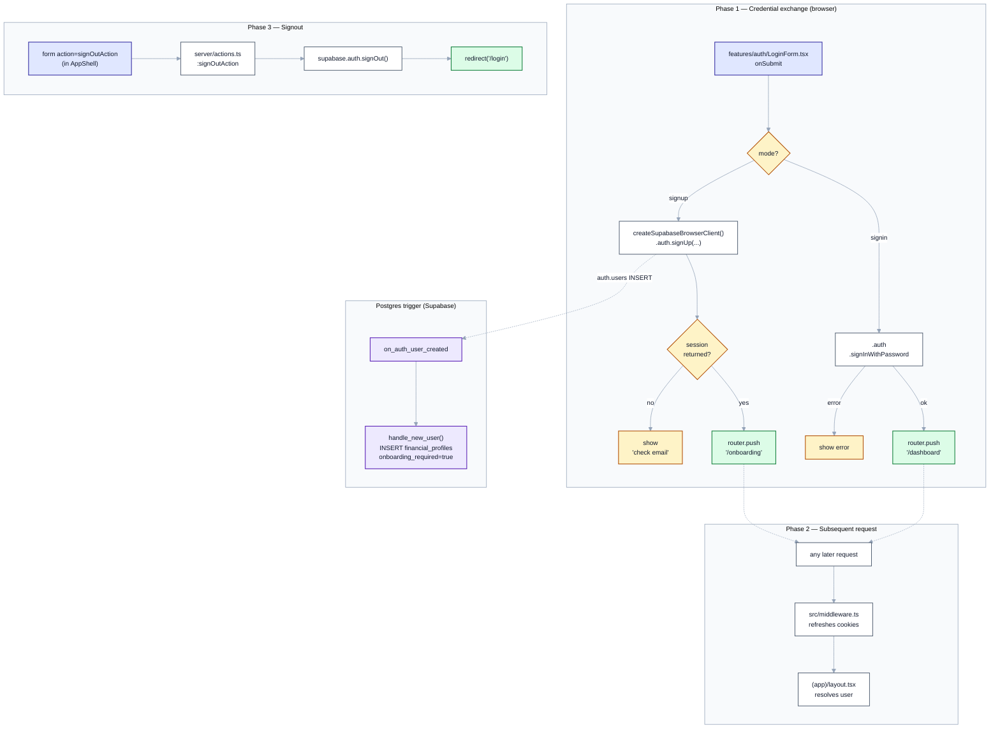

Note: per `supabase/migrations/20260508000000_profile_onboarding_financial_settings.sql`, the `handle_new_user()` function was extended to write `display_name` from `raw_user_meta_data` and `onboarding_required = true`; the initial migration only inserts `id`.

Note: §2.9 introduces a Shape 5 variant for advisor phone verification — `supabase.auth.updateUser({ phone })` triggers the OTP, `supabase.auth.verifyOtp({ type: "phone_change" })` confirms it, then `syncAdvisorVerifiedPhoneAction` mirrors the verified phone into `financial_profiles.phone_verified_at`. The diagram still applies; only the credential type (password → OTP) and the post-verify sync action change.

#### Shape 6 — Methodology modal (context-driven UI state, zero DB)

The "How it works" surface. Trigger fires anywhere (header button, inline `InfoTooltip`), state lives in React context, no server round-trip.

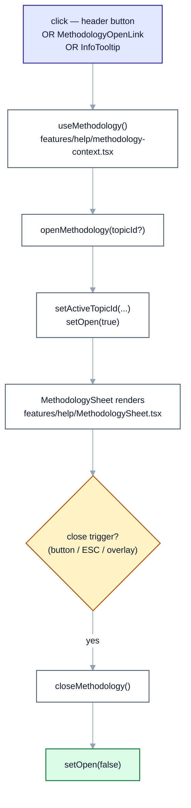

### §2.1 Authentication
<!-- last-verified: 2026-05-13 -->

Three flows, all rooted in `src/features/auth/LoginForm.tsx` (signin/signup) and `src/server/actions.ts:signOutAction` (signout). All use `@supabase/ssr` cookies — no manual token storage. Signup branches on role: advisors get a self-serve account and must provide a WhatsApp-capable phone number; clients must supply an advisor access key (validated via the `validate_client_access_key_for_signup` Postgres RPC). Sign-in resolves the user's `financial_profiles.profile_type` and routes advisors to `/advisor`, clients to `/dashboard` (or `/onboarding` / `/account-issue` per profile state).

| Workflow | Shape | Trigger | Entry symbol | Notable branches |
|---|---|---|---|---|
| Sign in | 5 | `src/features/auth/LoginForm.tsx` form submit, mode=`signin` | `supabase.auth.signInWithPassword` | error → inline error; ok → loads `financial_profiles`; **advisor** → `/advisor`; **client** → `/onboarding` / `/dashboard` / `/account-issue` (depending on `onboarding_required` and `advisor_user_id`) |
| Sign up — advisor | 5 | `LoginForm.tsx` form submit, role=`advisor` + `phone_e164` | `supabase.auth.signUp` with `raw_user_meta_data.profile_type = 'advisor'` and unverified `phone_e164` | DB trigger `handle_new_user` seeds `financial_profiles` row with `profile_type='advisor'`, `onboarding_required=false`, `phone_verified_at=null`; session → `/advisor` |
| Sign up — client | 5* | `LoginForm.tsx` form submit, role=`client` + `access_key` | `supabase.auth.signUp` with `raw_user_meta_data.profile_type='client'` and `access_key` | Pre-check via RPC `validate_client_access_key_for_signup(key)`; on signup, `handle_new_user` claims the key (status `available → claimed`) and seeds profile with `advisor_user_id`; session → `/onboarding`. Invalid/used/expired key → DB exception → form error. |
| Sign out | 1* | `<form action={signOutAction}>` in `src/features/app-shell/AppShell.tsx` | `src/server/actions.ts:signOutAction` | always `redirect('/login')` — returns no result object |

*Shape 1 variant — signout skips the validation/repo steps and `redirect()`s instead of returning `{error}`. Client signup is a Shape 5 variant — the access-key claim happens atomically inside `handle_new_user` (security-definer); the app does not write the link, the DB does.

### §2.2 Setup & Onboarding
<!-- last-verified: 2026-05-12 -->

Setup is a tabbed UI at `/setup?tab=<id>` populated by `src/features/setup/SetupTabsNav.tsx`. Onboarding is a separate wizard at `/onboarding` enforced by middleware (Shape 4) until the user marks it complete. Mutations land in `src/server/actions.ts` (most) or `PATCH /api/profile` (profile income with CPF recalc).

| Workflow | Shape | Entry symbol | Mutation symbol | Revalidates | Notable branches |
|---|---|---|---|---|---|
| Navigate Setup tab | 3 | `src/features/setup/SetupTabsNav.tsx` Link click → `/setup?tab=<id>` | _none_ (server re-render) | _none_ | URL query update; no DB write |
| Complete onboarding wizard | 2 | `src/features/onboarding/OnboardingWizard.tsx` final step → `PATCH /api/profile` | `src/data/repositories/profiles.ts:updateProfile` (with `onboarding_completed_at`, `onboarding_required=false`) | (caller-side `router.refresh()`) | Middleware (Shape 4) lets the user out of `/onboarding` on the next nav |
| Apply guided budget setup | 1 | `src/features/onboarding/OnboardingWizard.tsx` mid-step call → `src/server/actions.ts:applyGuidedBudgetLinesAction` | `src/data/repositories/budget-lines.ts:insertBudgetLine` × N (seed lines derived from `src/domain/finance/budget-guided-setup.ts:generateGuidedMonthlyBudgetLines`) | `/budget`, `/setup`, `/dashboard` | Confidence / lifestyle / food / strategy inputs map to a deterministic budget seed; called during onboarding or post-onboarding from the Setup tab |
| Edit financial profile (income / CPF / retirement assumptions) | 2 | `src/features/dashboard/ProfileIncomeForm.tsx` → `PATCH /api/profile` | `src/data/repositories/profiles.ts:updateProfile`; CPF recalc via `src/domain/finance/sg-cpf.ts:annualEmployeeCpfTakeHomeWithBonusSg` | (caller `router.refresh()`) | 400 if gross salary set without `cpf_age_band`; 400 on Zod fail |
| Upsert CPF balance | 1 | `src/features/goals/CpfBalancesForm.tsx` → `src/server/actions.ts:upsertCpfBalanceAction` | `src/data/repositories/cpf-balances.ts:upsertCpfBalance` | `/balances`, `/dashboard` | Inline validation: rates 0–25%, balances ≥ 0 |
| Clear CPF balance | 1 | form action → `src/server/actions.ts:clearCpfBalanceAction` | `src/data/repositories/cpf-balances.ts:deleteCpfBalance` | `/balances`, `/dashboard` | — |
| Add investment | 1 | `src/features/goals/InvestmentForm.tsx` → `src/server/actions.ts:createInvestmentAction` | `src/data/repositories/investments.ts:insertInvestment` | `/balances`, `/dashboard` | Inline validation: return 0–1 |
| Update investment | 1 | `src/features/goals/InvestmentForm.tsx` (edit mode) → `src/server/actions.ts:updateInvestmentAction` | `src/data/repositories/investments.ts:updateInvestment` | `/balances`, `/dashboard` | — |
| Add cash account | 1 | `src/server/actions.ts:createCashAccountAction` | `src/data/repositories/cash-accounts.ts:insertCashAccount` | `/balances`, `/dashboard` | — |
| Update cash account | 1 | `src/server/actions.ts:updateCashAccountAction` | `src/data/repositories/cash-accounts.ts:updateCashAccount` | `/balances`, `/dashboard` | — |
| Delete cash account | 1 | `src/server/actions.ts:deleteCashAccountAction` | `src/data/repositories/cash-accounts.ts:deleteCashAccount` | `/balances`, `/dashboard` | — |
| Add liability | 1 | `src/server/actions.ts:createLiabilityAction` | `src/data/repositories/liabilities.ts:insertLiability` | `/balances`, `/dashboard` | — |
| Update liability | 1 | `src/server/actions.ts:updateLiabilityAction` | `src/data/repositories/liabilities.ts:updateLiability` | `/balances`, `/dashboard` | — |
| Delete liability | 1 | `src/server/actions.ts:deleteLiabilityAction` | `src/data/repositories/liabilities.ts:deleteLiability` | `/balances`, `/dashboard` | — |
| Add vehicle | 1 | `src/features/goals/VehiclesPanel.tsx` → `src/server/actions.ts:createVehicleAction` | `src/data/repositories/vehicles.ts:insertVehicle` | `/balances`, `/dashboard` | SG-specific fields validated (COE, PARF, loan); see `src/domain/finance/vehicle-sg.ts` for asset model |
| Update vehicle | 1 | `src/server/actions.ts:updateVehicleAction` | `src/data/repositories/vehicles.ts:updateVehicle` | `/balances`, `/dashboard` | — |
| Delete vehicle | 1 | `src/server/actions.ts:deleteVehicleAction` | `src/data/repositories/vehicles.ts:deleteVehicle` | `/balances`, `/dashboard` | — |
| Add housing loan (full form) | 1 | `src/features/goals/HousingLoansPanel.tsx` → `src/server/actions.ts:createHousingLoanAction` | `src/data/repositories/housing-loans.ts:insertHousingLoan` | `/balances`, `/dashboard` | `lender_type` validated by `housingLenderTypeSchema` in `src/lib/validation.ts` |
| Add housing loan (quick) | 1 | `src/features/goals/HousingLoanQuickAddForm.tsx` → `src/server/actions.ts:createHousingLoanQuickAction` | `src/data/repositories/housing-loans.ts:insertHousingLoan` via `src/domain/finance/housing-loan-quick.ts:deriveQuickHousingLoanRow` | `/balances`, `/dashboard` | Defaults HDB concessionary rate from `HDB_CONCESSIONARY_RATE_ANNUAL` |
| Update housing loan | 1 | `src/server/actions.ts:updateHousingLoanAction` | `src/data/repositories/housing-loans.ts:updateHousingLoan` | `/balances`, `/dashboard` | — |
| Delete housing loan | 1 | `src/server/actions.ts:deleteHousingLoanAction` | `src/data/repositories/housing-loans.ts:deleteHousingLoan` | `/balances`, `/dashboard` | — |

### §2.3 Dashboard
<!-- last-verified: 2026-05-12 -->

The dashboard is the primary read surface. The page (`src/app/(app)/dashboard/page.tsx`) fetches everything in one composition call; the same payload is also exposed at `GET /api/dashboard` for client-driven month navigation.

| Workflow | Shape | Entry | Composition / mutation | Notable branches |
|---|---|---|---|---|
| View dashboard for current month | 3 | `GET /dashboard` → `src/app/(app)/dashboard/page.tsx` | `Promise.all([src/data/dashboard.ts:getDashboardPayload, src/data/repositories/profiles.ts:getProfileById])` | If `isSupabaseConfigured()` false → warning banner; if user null → sign-in CTA |
| Fetch dashboard for arbitrary month (API) | 2* | client fetch `GET /api/dashboard?month=YYYY-MM` → `src/app/api/dashboard/route.ts` | `src/data/dashboard.ts:getDashboardPayload` | Invalid month → silently falls back to current month |
| View retirement projection panel | 3 | rendered as part of dashboard payload | `src/features/dashboard/DashboardRetirementSection.tsx`; derived via `src/domain/finance/retirement-spend-vs-portfolio.ts` and `src/domain/finance/age-projection.ts` | Renders empty state if profile lacks `target_retirement_age` |
| Navigate dashboard subnav anchors | 6 | `src/features/dashboard/DashboardSubnav.tsx` click | _none_ (client-side scroll) | URL hash updates; no DB |

*Shape 2 variant — read-only (no conflict check, no Zod body parse; just query-param coercion).

### §2.4 Expenses
<!-- last-verified: 2026-05-12 -->

The two write paths (`POST` / `PATCH /api/expenses/[id]`) are the canonical home of Shape 2 because of the `hasBudgetCategoryMonthlyConflict` guard. Read path is server-rendered. Delete reuses Shape 2 minus the conflict check.

| Workflow | Shape | Entry | Repo symbol | Revalidates | Branches |
|---|---|---|---|---|---|
| Add expense | 2 | `src/features/expenses/ExpenseForm.tsx` → `POST /api/expenses` (`src/app/api/expenses/route.ts`) | `src/data/repositories/expenses.ts:insertExpense` | `/expenses`, `/budget`, `/setup`, `/dashboard` | 409 if `src/data/expense-budget-guard.ts:hasBudgetCategoryMonthlyConflict` returns true (monthly category already has an expense this month) |
| Quick-add expense from budget line | 2 | `src/features/budget/BudgetLineExpenseQuickAdd.tsx` → same `POST /api/expenses` | same | same | same; form prefills `category` from budget line |
| Edit expense | 2 | `src/features/expenses/ExpenseEditRow.tsx` → `PATCH /api/expenses/[id]` (`src/app/api/expenses/[id]/route.ts`) | `src/data/repositories/expenses.ts:updateExpense`; `getExpenseById` for existence check | `/expenses`, `/budget`, `/setup`, `/dashboard` | 404 if expense not found; 409 conflict (with `excludeExpenseId`) |
| Delete expense | 2* | `src/features/expenses/ExpenseEditRow.tsx` delete button → `DELETE /api/expenses/[id]` | `src/data/repositories/expenses.ts:deleteExpense` | `/expenses`, `/budget`, `/setup`, `/dashboard` | 404 if not found |
| View expenses by month | 3 | `GET /expenses` → `src/app/(app)/expenses/page.tsx` | `src/data/repositories/expenses.ts:listExpensesForMonth` | — | Month from `?month=YYYY-MM`, defaults to current |
| View spending-by-category chart | 3 | rendered in expenses page | `src/features/expenses/CategoryBarChart.tsx` (client island over server-rendered data) | — | Renders empty state if no expenses |

*Shape 2 variant — delete skips JSON parse and Zod validation (no body).

### §2.5 Budget
<!-- last-verified: 2026-05-12 -->

All budget mutations are server actions. Read path is server-rendered via `getBudgetPageModel`. Per-month overrides live in a separate table (`financial_budget_line_month_overrides`) so the base line stays stable while a one-off override applies.

| Workflow | Shape | Entry | Repo symbol | Revalidates | Branches |
|---|---|---|---|---|---|
| Add budget line | 1 | `src/features/budget/BudgetAddForm.tsx` → `src/server/actions.ts:createBudgetLineAction` | `src/data/repositories/budget-lines.ts:insertBudgetLine` | `/budget`, `/setup`, `/dashboard` | Inline validation: `isValidYearMonth` for monthly start/end; year range for annual |
| Update budget line amount | 1 | `src/features/budget/BudgetUpdateAmountForm.tsx` → `src/server/actions.ts:updateBudgetLineAmountAction` | `src/data/repositories/budget-lines.ts:updateBudgetLine` | `/budget`, `/setup`, `/dashboard` | — |
| Update budget line schedule (start/end month) | 1 | `src/features/budget/BudgetLineScheduleForm.tsx` → `src/server/actions.ts:updateBudgetLineScheduleAction` | `src/data/repositories/budget-lines.ts:updateBudgetLine` | `/budget`, `/setup`, `/dashboard` | Monthly-cadence only |
| Delete budget line | 1 | form action → `src/server/actions.ts:deleteBudgetLineAction` | `src/data/repositories/budget-lines.ts:deleteBudgetLine` | `/budget`, `/setup`, `/dashboard` | Cascades to override rows via FK |
| Set one-month override | 1 | `src/features/budget/BudgetMonthOverrideForm.tsx` → `src/server/actions.ts:setBudgetMonthOverrideAction` | `src/data/repositories/budget-line-overrides.ts:upsertBudgetLineMonthOverride` | `/budget`, `/setup`, `/dashboard` | — |
| Clear one-month override | 1 | `src/features/budget/BudgetMonthOverrideForm.tsx` clear → `src/server/actions.ts:clearBudgetMonthOverrideAction` | `src/data/repositories/budget-line-overrides.ts:deleteBudgetLineMonthOverride` | `/budget`, `/setup`, `/dashboard` | — |
| Jump to month | 6 | `src/features/budget/BudgetMonthJump.tsx` → `/budget?month=YYYY-MM` Link | _none_ | — | Server re-render via URL change |
| View budget for month | 3 | `GET /budget` → `src/app/(app)/budget/page.tsx` | `src/data/budget-summary.ts:getBudgetPageModel` | — | Empty state when no lines |
| Fetch budget model (API) | 2* | `GET /api/budget?month&year` → `src/app/api/budget/route.ts` | `src/data/budget-summary.ts:getBudgetPageModel` | — | 400 on `budgetQuerySchema` failure |
| Budget line action menu | 6 | `src/features/budget/BudgetLineActionsCollapsible.tsx` toggle | _none_ | — | Pure UI state |

*Shape 2 variant — read-only.

### §2.6 Balances
<!-- last-verified: 2026-05-12 -->

There is no dedicated `/balances` page anymore — `src/app/(app)/balances/page.tsx` redirects to `/setup` (and `/financial-profile`, `/goals`, `/spending` likewise redirect into other routes). All balance mutations are covered in §2.2 (investments, cash, liabilities, vehicles, housing loans, CPF). The list here is for navigation clarity only.

| Route | Behavior |
|---|---|
| `/balances` | `redirect('/setup')` (`src/app/(app)/balances/page.tsx`) |
| `/financial-profile` | `redirect('/setup')` |
| `/goals` | `redirect('/setup?tab=goals')` |
| `/spending` | `redirect('/expenses')` |

### §2.7 Goals
<!-- last-verified: 2026-05-12 -->

Goals are insert/update only — there is currently no delete server action for `financial_goals`. The projection endpoint is the one read API that runs domain math through composition layers rather than via a page composition.

| Workflow | Shape | Entry | Repo / composition symbol | Revalidates | Branches |
|---|---|---|---|---|---|
| Add financial goal | 1 | `src/features/goals/GoalForm.tsx` → `src/server/actions.ts:createGoalAction` | `src/data/repositories/goals.ts:insertFinancialGoal` | `/goals`, `/setup`, `/dashboard` | Inline validation: target > 0, return 0–1, optional `target_date` ISO format |
| Update financial goal | 1 | `src/features/goals/GoalEditForm.tsx` → `src/server/actions.ts:updateGoalAction` | `src/data/repositories/goals.ts:updateFinancialGoal` | `/goals`, `/setup`, `/dashboard` | — |
| View goals panel | 3 | rendered in `src/app/(app)/setup/page.tsx` (tab=goals) | `src/data/repositories/goals.ts:listFinancialGoals`; rendering via `src/features/goals/FinancialGoalsPanels.tsx` | — | Empty state if no goals |
| Fetch goal projection (time-to-target) | 2* | client fetch `GET /api/projection?targetAmount&investmentId&horizonMonths` → `src/app/api/projection/route.ts` | `src/data/projection.ts:resolveProjectionSnapshot`, `buildProjectionSeries`, `timeToGoalForTarget` | — | 404 if no investments; 400 on `projectionQuerySchema` fail |

*Shape 2 variant — read-only.

### §2.8 Help & Methodology
<!-- last-verified: 2026-05-12 -->

Static content + React context. No DB. Render path is entirely client-side once the provider is mounted in `AppShell`.

| Workflow | Shape | Entry | Notable |
|---|---|---|---|
| Open methodology (no specific topic) | 6 | "How it works" button in `src/features/app-shell/AppShell.tsx` → `openMethodology(null)` | Sheet opens to landing |
| Open methodology to specific topic | 6 | `src/features/help/MethodologyOpenLink.tsx` or `src/ui/InfoTooltip.tsx` click → `openMethodology(topicId)` | Sheet scrolls to topic anchor |
| Close methodology | 6 | close button / overlay / ESC inside `src/features/help/MethodologySheet.tsx` | `closeMethodology()` resets `isOpen` to false; `activeTopicId` preserved |

Static content source: `src/content/methodology-topics.ts` (the `METHODOLOGY_TOPICS` registry).

### §2.9 Advisor workspace, key purchases & contact
<!-- last-verified: 2026-05-13 -->

The advisor workspace is a separate set of routes under `/advisor/*` with its own shell variant. Advisor mutations are kept out of `src/server/actions.ts` because the audience and trust shape differ: legacy POC key generation remains in `src/server/advisor-access-key-actions.ts`, while coupon-backed purchase and phone/contact flows live in `src/server/advisor-key-purchase-actions.ts`. The data model includes `advisor_access_keys`, purchase/coupon tables, and advisor phone columns on `financial_profiles`; see §3.2 for the policies.

| Workflow | Shape | Entry | Mutation / RPC symbol | Revalidates | Notable branches |
|---|---|---|---|---|---|
| View advisor home | 3 | `GET /advisor` → `src/app/(app)/advisor/page.tsx` | `src/data/repositories/advisor-dashboard.ts:getAdvisorDashboardData` (clients + keys snapshot) | — | Empty state when no clients claimed yet |
| View clients roster | 3 | `GET /advisor/clients` → `src/app/(app)/advisor/clients/page.tsx` | `src/data/repositories/advisor-clients.ts:listClientsForAdvisor` | — | Non-financial summary columns only (POC); empty state if no clients |
| View access keys | 3 | `GET /advisor/access-keys` → `src/app/(app)/advisor/access-keys/page.tsx` | `src/data/repositories/advisor-access-keys.ts:listAdvisorAccessKeysForAdvisor` | — | Sections by `status` (available / claimed / expired) |
| Buy access keys | 1* | `GET /advisor/buy-keys` → `src/features/advisor/AdvisorBuyKeysSection.tsx` form submit | `src/server/advisor-key-purchase-actions.ts:buyAdvisorAccessKeysAction` → RPC `fulfill_access_key_purchase(...)` | `/advisor/access-keys`, `/advisor/buy-keys`, `/advisor` | Advisor-only; product `0001`; default POC coupon is `POCUNLIMITED`; idempotency key prevents duplicate fulfillment |
| Validate coupon quote | 1* | `AdvisorBuyKeysSection.tsx` coupon check button | `src/server/advisor-key-purchase-actions.ts:validateCouponForPurchaseAction` → RPC `validate_coupon_for_purchase(...)` | — | Server recomputes quote; RPC rate-limits coupon checks per advisor |
| Verify advisor phone | 5* | `GET /advisor/profile` → `src/features/advisor/AdvisorPhoneVerificationForm.tsx` | `supabase.auth.updateUser({ phone })`, `supabase.auth.verifyOtp({ type: 'phone_change' })`, then `syncAdvisorVerifiedPhoneAction` | `/advisor/profile`, `/advisor` | Phone is collected at signup but only exposed after Supabase OTP verification |
| Contact advisor | 1* | Client header button `src/features/app-shell/ContactAdvisorButton.tsx` | `src/server/advisor-key-purchase-actions.ts:getMyAdvisorContactAction` → RPC `get_my_advisor_contact()` | — | Clients receive a derived WhatsApp URL only; no direct client SELECT of advisor profile rows |
| View linked client workspace | 3 | `GET /advisor/client/[id]` → `src/app/(app)/advisor/client/[id]/page.tsx` | `src/data/repositories/advisor-clients.ts:getClientProfileForAdvisor` (link check) + `Promise.all` of `getDashboardPayload`, `listFinancialGoals`, `listBudgetLines`, `listInvestments` for the target client | — | Renders `src/features/advisor/AdvisorClientWorkspace.tsx`; `notFound()` if the client is not linked to the calling advisor; cross-advisor reads enforced by RLS migration `20260513000000_advisor_linked_client_rls.sql` |
| Edit client profile (on-behalf) | 1* | `src/features/advisor/forms/AdvisorProfilePatchForm.tsx` → `src/server/advisor-client-actions.ts:patchAdvisorClientProfileAction` | `src/data/repositories/profiles.ts:updateProfile` after `requireAdvisorLinkedClient` link check | `/advisor/client/[id]` | Advisor must be the client's `advisor_user_id`; whitelist of patchable fields enforced server-side |
| Edit client budget line amount (on-behalf) | 1* | `src/features/advisor/forms/AdvisorBudgetLineAmountForm.tsx` → `src/server/advisor-client-actions.ts:patchAdvisorClientBudgetLineAmountAction` | `src/data/repositories/budget-lines.ts:updateBudgetLine` after `requireAdvisorLinkedClient` | `/advisor/client/[id]` | Same link check; budget-line ownership verified against client id |
| Edit client goal monthly contribution (on-behalf) | 1* | `src/features/advisor/forms/AdvisorGoalContributionForm.tsx` → `src/server/advisor-client-actions.ts:patchAdvisorClientGoalMonthlyContributionAction` | `src/data/repositories/goals.ts:updateFinancialGoal` after `requireAdvisorLinkedClient` | `/advisor/client/[id]` | Same link check; goal ownership verified against client id |
| Account-issue landing | 3 | `GET /account-issue` → `src/app/(app)/account-issue/page.tsx` | _none_ | — | Shown when a client profile has `advisor_user_id = null` (data-integrity recovery path) |

*Shape 1 / Shape 5 variants — advisor actions return richer result objects (`{error, info, keys}` or contact payloads) and Postgres RPCs are the authoritative pricing/contact boundary. Phone verification is a Shape 5 extension because it uses Supabase Auth OTP before syncing profile state.

**Cross-cutting points** worth noting:
- **Middleware routing** (Shape 4 variant; see `src/middleware.ts`): advisors on any client app route or `/onboarding` → `/advisor`; clients on `/advisor/*` → `/account-issue` / `/onboarding` / `/dashboard` (whichever applies); clients with `advisor_user_id = null` → `/account-issue` from any gated client route.
- **Shell chrome** (`src/features/app-shell/AppShell.tsx`): the `workspace` prop resolved in `src/app/(app)/layout.tsx` selects advisor nav (Overview / Clients / Access keys / Buy keys) vs client nav (Dashboard / Spending / Setup / Goals). Advisors with missing/unverified phone see `AdvisorPhonePromptBanner`; clients get `ContactAdvisorButton`, which calls the controlled contact RPC.
- **Login redirect** (`src/features/auth/LoginForm.tsx`): post-signin reads `financial_profiles` once and routes by role — see §2.1.

---

## §3 Technical Design
<!-- last-verified: 2026-05-12 -->

Cross-cutting concerns. Each subsection is the single canonical home for its pattern — feature code should follow these conventions rather than reinventing them per domain.

### §3.1 Auth model
<!-- last-verified: 2026-05-13 -->

`@supabase/ssr` with cookie-based sessions. Two clients, one per execution context:

- **Server client** — `src/data/supabase/server.ts:createSupabaseServerClient`. Wraps `createServerClient` with Next.js `cookies()`. The `setAll` callback swallows the write error when invoked from a server component (where mutable cookies aren't allowed); writes succeed in route handlers and middleware.
- **Browser client** — `src/data/supabase/browser.ts:createSupabaseBrowserClient`. Wraps `createBrowserClient`. Used by `src/features/auth/LoginForm.tsx` for `signUp` / `signInWithPassword` and by `src/features/advisor/AdvisorPhoneVerificationForm.tsx` for Supabase phone-change OTP.

**Session refresh** is the middleware's job. `src/middleware.ts` runs on every non-static request, calls `supabase.auth.getUser()`, and pipes refreshed cookies through `request.cookies.set` + `supabaseResponse.cookies.set`. This is the only place session rotation happens.

**Layout-level user resolution.** `src/app/(app)/layout.tsx` (declared `force-dynamic`) resolves the user and profile once per request and passes both to `AppShell`. Pages then re-fetch the user as needed — there is no shared React-context user store on the server.

**Signout** is a server action: `src/server/actions.ts:signOutAction`. The button lives in `src/features/app-shell/AppShell.tsx` as `<form action={signOutAction}>`. After `signOut()` it `redirect('/login')`s.

**Onboarding gate.** Enforced in middleware (Shape 4 in §2.0). The middleware fetches `financial_profiles.onboarding_required` + `onboarding_completed_at` for the authenticated user; redirects to `/onboarding` if incomplete, or away from `/onboarding` if complete. This avoids per-page guards and keeps the rule in one place.

**Role routing.** The same middleware pass also reads `financial_profiles.profile_type` and `advisor_user_id`. Routing rules:

- **Advisors** on any client app route (`/dashboard`, `/expenses`, `/budget`, `/setup`, `/balances`, `/goals`, `/financial-profile`, `/spending`, `/account-issue`) or `/onboarding` → redirect `/advisor`. Advisors do not consume client onboarding or personal-finance surfaces.
- **Clients** on any `/advisor/*` route → redirect based on profile state: `/account-issue` (if `advisor_user_id` null), `/onboarding` (if onboarding still required), or `/dashboard` (normal).
- **Clients with `advisor_user_id = null`** on any gated client route → redirect `/account-issue` (data-integrity recovery path).
- **Onboarding enforcement** applies only to clients with `onboarding_required = true` and no `onboarding_completed_at`. Advisors are seeded with `onboarding_required = false` by `handle_new_user` and bypass the wizard entirely (see `supabase/migrations/20260512000001_advisor_skip_onboarding.sql` and `supabase/migrations/20260517100000_advisor_key_purchases_coupons_contact.sql`).

**Role helpers.** Centralized in `src/lib/profile-role.ts` — `getCurrentUserRole`, `isAdvisor`, `isClient`, `normalizeFinancialProfileType`, `clientAdvisorRelationshipOk`. Use these rather than inlining `profile.profile_type === 'advisor'` checks.

**Layout-level workspace resolution.** `src/app/(app)/layout.tsx` resolves `workspace: 'advisor' | 'client'` from the profile and passes it to `AppShell`, which selects the role-appropriate header brand link, subtitle, nav, advisor phone prompt, and client contact-advisor button.

### §3.2 Authorization & RLS
<!-- last-verified: 2026-05-13 -->

**The trust boundary is Postgres.** Every user-scoped table has Row Level Security enabled with policies of the form `user_id = auth.uid()` (or `id = auth.uid()` for `financial_profiles`). All four operations are policy-gated separately: SELECT, INSERT (with check), UPDATE, DELETE.

Tables (current names per the rename in `supabase/migrations/20260507000000_rename_public_tables_financial_prefix.sql`):

- `financial_profiles` — one row per user; PK referenced by every other table; carries `profile_type` (`advisor` | `client`), optional `advisor_user_id` (for clients), and advisor phone verification fields per `supabase/migrations/20260512000000_advisor_client_access_keys.sql` and `supabase/migrations/20260517100000_advisor_key_purchases_coupons_contact.sql`
- `financial_expenses`
- `financial_investments`
- `financial_goals`
- `financial_budget_lines`
- `financial_budget_line_month_overrides`
- `financial_cash_accounts`
- `financial_liabilities`
- `financial_vehicles`
- `financial_cpf_balances` (PK on `user_id` — one row per user)
- `financial_housing_loans`
- `advisor_access_keys` — separate from the `financial_*` namespace; advisor-issued tokens that clients claim during signup (see "Advisor access-key model" below)
- `pricing` — product catalogue; `product_code='0001'` is the first advisor access-key product, priced in SGD
- `coupons` — global or advisor-scoped coupon definitions; not directly selectable by app users
- `purchases` — advisor access-key purchase records with a Stripe-compatible status/provider shape
- `coupon_redemptions` — coupon usage audit rows linked to purchases
- `coupon_validation_attempts` — short-lived server-side rate-limit audit for coupon checks

**Consequence — the app uses the anon key only.** No service role key anywhere. The `NEXT_PUBLIC_SUPABASE_ANON_KEY` is the same key in the browser and on the server; RLS is what makes it safe. If a bug let the wrong user's row through, RLS would still block it.

**Consequence — `userId` in repository signatures is structural, not authoritative.** Functions like `src/data/repositories/expenses.ts:insertExpense(supabase, userId, row)` pass `userId` into the `INSERT` statement, but the database enforces `user_id = auth.uid()` independently. If the JWT and the passed `userId` disagree, Postgres rejects.

**Cascade-on-user-delete.** Every user-scoped FK is `on delete cascade` against `financial_profiles.id` (which itself cascades from `auth.users(id)`). Deleting a user removes their profile, which removes everything else. For `advisor_access_keys`, the `advisor_user_id` FK is `on delete cascade` and the `claimed_by_user_id` FK is `on delete set null` — deleting a claimed client preserves the audit trail.

**Trigger.** `handle_new_user()` (security-definer plpgsql) fires `after insert on auth.users` and seeds the `financial_profiles` row. For advisor signups it sets `profile_type='advisor'`, `onboarding_required=false`, `advisor_user_id=null`, and stores `raw_user_meta_data.phone_e164` as unverified contact data. For client signups it reads `raw_user_meta_data.access_key`, atomically claims a matching `available` row in `advisor_access_keys` (with `for update` lock), and seeds the profile with `profile_type='client'`, `advisor_user_id` from the key's issuer. Invalid / used / expired keys raise an exception, aborting the auth-user creation. See `supabase/migrations/20260410000000_init.sql`, `supabase/migrations/20260508000000_profile_onboarding_financial_settings.sql`, `supabase/migrations/20260512000000_advisor_client_access_keys.sql`, and `supabase/migrations/20260517100000_advisor_key_purchases_coupons_contact.sql`.

**Advisor access-key model.**

- **Table:** `advisor_access_keys` — columns: `id`, `advisor_user_id` (FK auth.users, cascade), optional `purchase_id`, `access_key` (unique), `status` (`available` | `claimed` | `expired`), `claimed_by_user_id` (FK auth.users, set null), `claimed_at`, `expires_at`, `created_at`. Indexes on `(advisor_user_id)`, `(advisor_user_id, status)`, and `(purchase_id)`.
- **RLS** (`supabase/migrations/20260512000000_advisor_client_access_keys.sql`):
  - `advisor_access_keys_select_own` — `using (advisor_user_id = (select auth.uid()))`
  - `advisor_access_keys_insert_own` — `with check (advisor_user_id = (select auth.uid()))`
  - `advisor_access_keys_update_own` — `using (...) with check (...)` — same predicate on both
  - No DELETE policy — the table is append-and-claim; keys move to `expired` via UPDATE.
- **Cross-advisor read on `financial_profiles`** (`supabase/migrations/20260512000002_advisor_select_linked_clients.sql`): an additional policy `financial_profiles_select_advisor_clients` adds an OR-branch to the existing own-row SELECT — advisors may read `financial_profiles` rows where `profile_type='client' AND advisor_user_id = (select auth.uid())`. Other advisors' clients remain invisible.
- **Advisor edit-on-behalf-of-linked-client** (`supabase/migrations/20260513000000_advisor_linked_client_rls.sql`): a comprehensive `_advisor_clients` policy family on every user-scoped financial table (`financial_expenses`, `financial_investments`, `financial_goals`, `financial_budget_lines`, `financial_budget_line_month_overrides`, `financial_cash_accounts`, `financial_liabilities`, `financial_vehicles`, `financial_cpf_balances`, `financial_housing_loans`) plus a UPDATE policy on `financial_profiles`. Each policy gates SELECT/INSERT/UPDATE/DELETE on `exists (select 1 from financial_profiles where id = <table>.user_id and advisor_user_id = (select auth.uid()))`. This is what backs the CRM-style on-behalf workflows in §2.9 — the app layer's `requireAdvisorLinkedClient` helper is structural; Postgres is the gate.
- **RPC for pre-signup validation:** `validate_client_access_key_for_signup(p_key text) returns boolean`, security-definer, `grant execute to anon, authenticated`. Returns true only when a normalized key exists with `status='available'` and not expired. Used by `src/features/auth/LoginForm.tsx` to validate a key before calling `supabase.auth.signUp`.

**Advisor key-purchase and contact model.**

- **Pricing / purchase tables** (`pricing`, `purchases`) are readable only where needed (`pricing` to authenticated, `purchases` to owning advisor). Client code never writes them directly; inserts happen inside `fulfill_access_key_purchase(...)`.
- **Coupon tables** (`coupons`, `coupon_redemptions`, `coupon_validation_attempts`) are RPC-only for app users. RLS policies explicitly deny direct authenticated DML; security-definer RPCs validate advisor role, rate-limit checks, lock coupon rows, and decrement limited redemptions atomically.
- **POC coupon:** `POCUNLIMITED` is seeded as an unlimited, never-expiring 100% discount coupon. Future per-advisor grant UI can create advisor-scoped rows through the same schema.
- **Contact disclosure:** clients do not get a policy that can read advisor profile rows. `get_my_advisor_contact()` checks the caller is a linked client, verifies the advisor phone is set and verified, then returns a derived `wa.me` URL without exposing the raw profile row.

### §3.3 Data validation boundaries
<!-- last-verified: 2026-05-13 -->

Three layers, in order:

1. **Client-side** — inline form validation for UX (required fields, non-negative numbers). Not authoritative. Lives in the form component.
2. **Application layer — Zod** — `src/lib/validation.ts`. Every route handler validates request bodies with one of: `expensePostSchema`, `expensePatchSchema`, `profilePatchSchema`, `budgetQuerySchema`, `projectionQuerySchema`. The advisor key-purchase + phone flow added three more schemas consumed via `safeParse`: `e164PhoneSchema`, `advisorAccessKeyPurchaseQuantitySchema`, `couponCodeInputSchema`. Server actions in `src/server/actions.ts` still use inline `Number.isFinite` / `String` / `trim` checks, but `src/server/advisor-key-purchase-actions.ts` uses Zod throughout — so the action-vs-route Zod gap is narrowing rather than project-wide. Full unification remains a candidate ADR.
3. **Database — CHECK constraints + types + RLS** — numeric ranges (`expected_annual_return BETWEEN 0 AND 1`), non-negative balances, FK integrity. The DB is the final say.

**Numeric precision.** All numeric DB values are typed as `string` in `src/data/supabase/types.ts` (e.g. `ExpenseRow.amount: string`). This preserves precision through JSON serialization. Conversion to `number` happens at the read-time seam — `src/data/mappers.ts:num` is the canonical helper. Domain functions take `number`; repository return types stay `string`.

**Zod schemas are the wire contract.** Where a schema exists, that's the source of truth for what the route accepts. The corresponding row type in `src/data/supabase/types.ts` is the read shape. They overlap but are not the same (writes accept fewer fields; reads emit DB-defaulted fields).

### §3.4 Error handling
<!-- last-verified: 2026-05-12 -->

Two surfaces, two conventions:

**Route handlers** — return JSON `{ error: string, details?: object }` with a status code:
- `400` — invalid JSON or Zod validation failure (`details` includes Zod's `flatten()`)
- `401` — no authenticated user
- `404` — entity not found (only used in `PATCH/DELETE /api/expenses/[id]`)
- `409` — business-rule conflict (`hasBudgetCategoryMonthlyConflict`)
- `500` — caught repository or composition error; the original error is `console.error`'d
- `503` — Supabase env vars not configured (`isSupabaseConfigured()` false)

**Server actions** — return `{ error: string | null }`. The form component reads the error and renders it inline. `null` means success. Repository throws are currently NOT caught inside actions — an unhandled throw becomes a server-side error and surfaces as an opaque failure to the form. This is a known gap (candidate ADR: should actions adopt a try/catch + `{error}` convention parallel to route handlers?). Advisor purchase / contact actions in `src/server/advisor-key-purchase-actions.ts` return richer result objects (`{ error, info?, keys?, contact? }`) since the form needs to render generated keys and human-readable info alongside errors; the bare-`{error}` shape is still the default for the 27 actions in `src/server/actions.ts` and the 3 in `src/server/advisor-client-actions.ts`.

**No global error boundary.** Pages don't currently define `error.tsx`. A future improvement; pages handle their own empty / not-configured / not-signed-in branches inline (see Shape 3).

**Uncaught domain errors** in pure functions (`src/domain/finance/*`) bubble up as plain `Error` instances. They are not currently differentiated from infrastructure errors at the API surface.

### §3.5 Cache & revalidation
<!-- last-verified: 2026-05-13 -->

**The consistency model is `revalidatePath`-driven.** Every mutation explicitly invalidates the paths whose data it affects. There is no per-tag invalidation, no SWR/TanStack-style client cache, no DB change-listener stream.

**`force-dynamic` on the app layout.** `src/app/(app)/layout.tsx` declares `export const dynamic = "force-dynamic"`, which opts the whole authenticated subtree out of static rendering. Every navigation re-fetches.

**Revalidation matrix** (paths most often revalidated together):

| Mutation type | Paths revalidated |
|---|---|
| Expense write (POST/PATCH/DELETE) | `/expenses`, `/budget`, `/setup`, `/dashboard` |
| Budget mutation | `/budget`, `/setup`, `/dashboard` |
| Balance / investment / cash / liability mutation | `/balances`, `/dashboard` |
| Vehicle / housing loan mutation | `/balances`, `/dashboard` |
| CPF balance upsert / clear | `/balances`, `/dashboard` |
| Goal mutation | `/goals`, `/setup`, `/dashboard` |
| Advisor access-key purchase | `/advisor/access-keys`, `/advisor/buy-keys`, `/advisor` |
| Advisor phone verification | `/advisor/profile`, `/advisor` |

**Client-side complement.** After a server action returns success, the calling component typically also calls `router.refresh()` to refetch the current route's RSC tree. Examples: `src/features/auth/LoginForm.tsx`, expense forms.

**Note.** `/balances`, `/goals`, `/spending`, `/financial-profile` all redirect to other routes (see §2.6). Revalidating them is still cheap; the redirect target's revalidation is what users actually see.

### §3.6 State & data flow
<!-- last-verified: 2026-05-12 -->

**Server-driven.** Pages are server components; they fetch via repositories or composition layers (`src/data/dashboard.ts`, `src/data/budget-summary.ts`, etc.) and embed client islands only where interactivity is needed.

**No client data-fetching library.** No TanStack Query, no SWR, no Redux. Client islands either:
1. Receive their data as props from the server (most common), or
2. Issue a one-off `fetch` to an `/api/*` route handler (dashboard month picker, projection, expenses month switch).

**Mutation surface — two flavors:**
- **Server actions** (`src/server/actions.ts`) — for forms in feature components. `useActionState` / `useTransition` pattern. Returns `{error: string | null}`.
- **Route handlers** (`src/app/api/*/route.ts`) — for client `fetch` mutations that need JSON return values (expenses POST/PATCH/DELETE) or where business logic is awkward to embed in a server action (profile CPF recalculation).

**URL as state container.** Month context (`?month=YYYY-MM`) and setup tab (`?tab=<id>`) live in the URL — bookmarkable and survives navigation. Built via helpers in `src/lib/setup-urls.ts` and `src/lib/dates.ts:formatYearMonth`.

**Methodology modal state** is one of the few pieces of pure-client React-context state — see `src/features/help/methodology-context.tsx`.

### §3.7 Type system boundaries
<!-- last-verified: 2026-05-13 -->

**`src/data/supabase/types.ts` is hand-maintained, not generated.** Every row type is written by hand to mirror the migration schema. Numeric fields are typed `string` (see §3.3).

This is a deliberate choice — `supabase gen types` would couple the build to a Supabase project URL and lose the ability to comment column semantics inline. The cost is drift risk: a migration that adds a column without a matching type-file edit will not fail TypeScript. Candidate ADR.

**`@/*` path alias** maps to `src/*` (`tsconfig.json:compilerOptions.paths`). All internal imports go through it; no relative ladder imports across feature boundaries.

**Strict TS.** `tsconfig.json` enables strict mode; no `any` is permitted by lint.

**Zod types vs row types.** Two parallel type systems with deliberate non-overlap:
- Zod schemas (`src/lib/validation.ts`) = wire format on writes.
- Row types (`src/data/supabase/types.ts`) = read shape from Postgres.
- Domain types (`src/domain/finance/types.ts`) = the calc-layer's view of the world (numeric, fully populated).

Mapping happens at the repository layer (`src/data/mappers.ts:num` and friends).

**Recent additions** worth tracking when the type-vs-migration drift skill runs:
- `ProfileRow` gains `profile_type: FinancialProfileType` and `advisor_user_id: string | null` (per `supabase/migrations/20260512000000_advisor_client_access_keys.sql`).
- `ProfileRow` also includes advisor `phone_e164` and `phone_verified_at` for the verified-contact flow.
- `FinancialProfileType` is exported from `src/data/supabase/types.ts` as the union `'advisor' | 'client'`.
- `AdvisorAccessKeyRow` includes `purchase_id` for keys fulfilled through the purchase RPC.
- `PricingRow`, `CouponRow`, `PurchaseRow`, `CouponRedemptionRow`, and `CouponValidationAttemptRow` mirror the advisor key-purchase schema.
- Three string-literal unions are exported alongside the new rows: `PurchaseStatus` (`'pending' | 'paid' | 'fulfilled' | 'failed' | 'refunded'`), `PaymentProvider` (`'mock' | 'stripe'`), `CouponKind` (`'discount_percent' | 'free_keys'`).

### §3.8 Configuration & secrets
<!-- last-verified: 2026-05-13 -->

**Public environment variables.**

- `NEXT_PUBLIC_SUPABASE_URL` — Supabase project URL.
- `NEXT_PUBLIC_SUPABASE_ANON_KEY` — anonymous key. Safe in the browser because RLS enforces row scoping.

**Supabase Auth Phone.** Advisor phone verification uses Supabase Auth's phone-change OTP flow (`updateUser({ phone })` then `verifyOtp({ type: "phone_change" })`). Hosted projects must enable Phone in Supabase Auth Providers and configure an SMS provider such as Twilio, MessageBird, or Vonage in the Supabase project; this is server-side Supabase configuration, not a Next.js environment flag.

**Gating at the seam.** Every code path that needs Supabase first calls `src/lib/env.ts:isSupabaseConfigured` (graceful — returns boolean) or `src/lib/env.ts:requireSupabaseEnv` (strict — throws). Pages render a "set your `.env.local`" banner instead of failing if both vars are absent.

**No service role key.** Deliberate — see §3.2.

**Local development.** `.env.local` at the project root holds both vars. Gitignored. There is no `.env.example`; the `/login` page itself shows what to set when keys are missing.

**Two more configs at the project root** worth noting:

- `next.config.ts` — currently empty stub (no custom config).
- `tsconfig.json` — `target: ES2017`, strict mode, `@/*` path alias to `./src/*`.

### §3.9 Observability
<!-- last-verified: 2026-05-12 -->

**Current state: none beyond defaults.** No structured logging, no APM, no Sentry, no Supabase log forwarding, no custom traces. Errors `console.error` to the Node runtime stdout (for route handlers) or the browser console (for client islands).

This is acceptable for a single-author personal project at this stage. Future work, in rough order:
1. Capture server-handler errors with cause/stack to an external sink.
2. Surface Supabase request latencies (the `@supabase/supabase-js` client emits timings).
3. Page error boundaries (`error.tsx`) to render user-friendly recovery UI.

**Gap intentionally documented**, not silently absent.

### §3.10 Testing
<!-- last-verified: 2026-05-13 -->

**Vitest, ten spec files — eight pure-domain, two utility-lib:**

Pure-domain (`src/domain/finance/`):
- `advisor-client-health.test.ts`
- `budget-guided-setup.test.ts`
- `cpf-monthly-projection.test.ts`
- `housing-loan-estimate.test.ts`
- `housing-loan-quick.test.ts`
- `mortgage-amortization.test.ts`
- `projection.test.ts`
- `vehicle-sg.test.ts`

Utility-lib (`src/lib/`):
- `phone-format.test.ts` — E.164 normalisation used by advisor phone-verify (§2.9)
- `whatsapp-link.test.ts` — `wa.me` URL builder used by the `get_my_advisor_contact()` flow

`src/lib/` is the new (small) home for pure utility tests outside the domain layer; both files are import-free of Supabase, React, and Next.js, so they stay in the fast default suite.

Run: `npm test` → `vitest run` (see `package.json:scripts.test`). Config: `vitest.config.ts`.

**No integration tests, no E2E tests.** Repositories, route handlers, server actions, middleware, and React components are all untested. The domain layer's purity makes it the cheapest place to test — and the test suite reflects that.

**Cross-cutting invariants currently not tested:**
- RLS enforcement under crafted JWTs — including the cross-advisor read policy `financial_profiles_select_advisor_clients` and the `advisor_access_keys_*_own` policies.
- The `hasBudgetCategoryMonthlyConflict` guard end-to-end.
- Middleware redirect logic — especially the role-routing branches (advisor → `/advisor`, client → `/account-issue` / `/onboarding` / `/dashboard`).
- Server-action error pathways — including `generateAdvisorAccessKeysPocAction` role gate and the atomic key-claim in `handle_new_user`.
- Access-key token collision avoidance under high parallelism (`generateUniqueAdvisorAccessKeys` retries up to `count × 40` times before throwing — verify the throw path).

When adding integration tests, gate them behind a separate vitest project so the fast pure-domain suite remains the default.

### §3.11 Domain logic isolation
<!-- last-verified: 2026-05-12 -->

**`src/domain/finance/` is pure.** No Supabase imports, no React imports, no Next.js imports, no fetch, no DB. It is a library of financial functions that takes plain inputs and returns plain outputs.

This is the load-bearing architectural decision — it's what lets the domain be unit-tested independently and makes the math reviewable in isolation.

**The seam.** Composition layers (`src/data/dashboard.ts`, `src/data/projection.ts`, `src/data/age-asset-breakdown.ts`, etc.) are the bridge: they fetch rows via repositories, convert `string` columns to `number` via `src/data/mappers.ts:num`, call domain functions, and return the resulting derived shape to the page or route handler.

**Singapore-specific modules** that live in the domain layer:
- `src/domain/finance/sg-cpf.ts` and `src/domain/finance/sg-cpf-contribution-buckets.ts` — CPF rates, age bands, contribution allocation
- `src/domain/finance/cpf-monthly-projection.ts` — month-by-month CPF projection
- `src/domain/finance/vehicle-sg.ts` — depreciation, COE, PARF, ARF, road tax
- `src/domain/finance/housing-loan-quick.ts` and `housing-loan-estimate.ts` — HDB / bank loan models
- `src/domain/finance/mortgage-amortization.ts` — amortization schedule

These are SG-specific facts living next to general financial calc. The current trade-off is simplicity (no regional abstraction overhead) at the cost of being SG-locked. Candidate ADR if internationalization is ever in scope.

---

## §4 C4 Diagrams
<!-- last-verified: 2026-05-13 -->

The three diagrams reflect the system's current state. Edits to architecture must land here in the same change.

### §4.1 Context

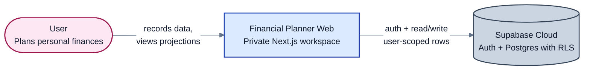

### §4.2 Container

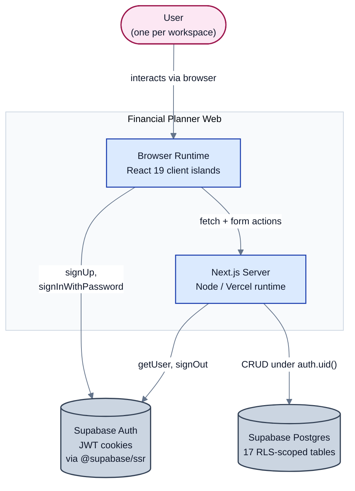

### §4.3 Component (overview)

Components inside the Next.js Server container. The `domain` component is shown deliberately disconnected from Supabase — that purity boundary is the load-bearing architectural property called out in §3.11.

The four sub-sections that follow drill into the components with the richest internal structure: the pure domain layer, the composition layers that bridge repositories and pages, the server-action mutation surface, and the repository-to-table mapping. Middleware, layout, route handlers, and validation are intentionally not drilled — their inner workings already appear in the §2.0 shape diagrams.

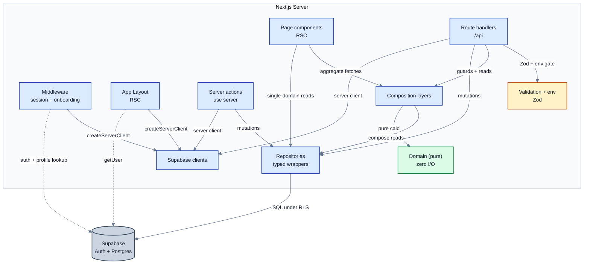

**Component → file map:**

| Component | Files |
|---|---|
| Middleware | `src/middleware.ts` |
| App Layout | `src/app/(app)/layout.tsx` |
| Page components | `src/app/(app)/*/page.tsx` (dashboard, expenses, setup, budget, onboarding, advisor, account-issue, …) |
| Route handlers | `src/app/api/**/route.ts` (expenses, dashboard, profile, budget, projection) |
| Server actions | `src/server/actions.ts` (general client mutations), `src/server/advisor-access-key-actions.ts` (legacy POC key generation), `src/server/advisor-key-purchase-actions.ts` (advisor purchase / coupon / phone-sync / contact RPC), `src/server/advisor-client-actions.ts` (advisor edit-on-behalf-of-linked-client) |
| Repositories | `src/data/repositories/` (17 files — 11 client-data + 6 advisor/purchase) |
| Composition layers | `src/data/dashboard.ts`, `src/data/budget-summary.ts`, `src/data/projection.ts`, `src/data/expense-budget-guard.ts`, `src/data/age-asset-breakdown.ts`, `src/data/spend-recommendations-from-month.ts`, `src/data/financial-profile.ts`, `src/data/mappers.ts` |
| Supabase clients | `src/data/supabase/server.ts`, `src/data/supabase/browser.ts` |
| Validation + env | `src/lib/validation.ts`, `src/lib/env.ts` |
| Role helpers | `src/lib/profile-role.ts` (`isAdvisor`, `isClient`, `getCurrentUserRole`) |
| Access-key tokens | `src/lib/advisor-access-key-token.ts` (`generateUniqueAdvisorAccessKeys`, `ADVISOR_ACCESS_KEY_BATCH_POC`) |
| Advisor UI | `src/features/advisor/AdvisorAccessKeysSection.tsx`, `src/features/advisor/AdvisorBuyKeysSection.tsx`, `src/features/advisor/AdvisorPhoneVerificationForm.tsx`, `src/features/advisor/AdvisorClientWorkspace.tsx`, `src/features/advisor/forms/AdvisorProfilePatchForm.tsx`, `src/features/advisor/forms/AdvisorBudgetLineAmountForm.tsx`, `src/features/advisor/forms/AdvisorGoalContributionForm.tsx`, `src/features/auth/PhoneInputField.tsx`, `src/features/app-shell/AdvisorPhonePromptBanner.tsx`, `src/features/app-shell/ContactAdvisorButton.tsx` |
| Domain (pure) | `src/domain/finance/` (26 files — see §4.3.1) |

### §4.3.1 Domain sub-components — `src/domain/finance/`
<!-- last-verified: 2026-05-12 -->

The 26 files in `src/domain/finance/` group into eight conceptual sub-domains. Edges show calc-time dependencies (not import edges — many modules also share `types.ts`).

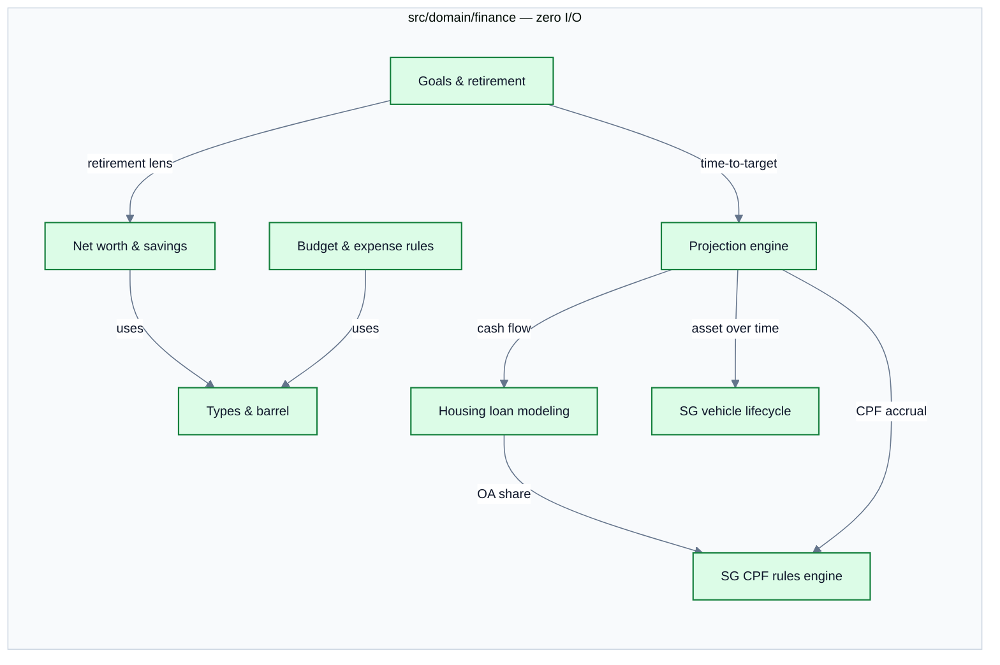

**Sub-component → file map (8 groups → 26 files):**

| Sub-component | Files |
|---|---|
| Types & barrel | `src/domain/finance/types.ts`, `src/domain/finance/index.ts` |
| Net worth & savings | `src/domain/finance/net-worth.ts`, `src/domain/finance/savings-rate.ts` |
| Budget & expense rules | `src/domain/finance/budget.ts`, `src/domain/finance/expense-budget-lock.ts`, `src/domain/finance/insights.ts` |
| SG CPF rules engine | `src/domain/finance/sg-cpf.ts`, `src/domain/finance/sg-cpf-contribution-buckets.ts`, `src/domain/finance/cpf-monthly-projection.ts` |
| Housing loan modeling | `src/domain/finance/housing-loan-quick.ts`, `src/domain/finance/housing-loan-estimate.ts`, `src/domain/finance/mortgage-amortization.ts` |
| SG vehicle lifecycle | `src/domain/finance/vehicle-sg.ts` |
| Projection engine | `src/domain/finance/projection.ts`, `src/domain/finance/age-projection.ts` |
| Goals & retirement | `src/domain/finance/goal-deadline.ts`, `src/domain/finance/goal-standalone.ts`, `src/domain/finance/retirement-spend-vs-portfolio.ts`, `src/domain/finance/spend-recommendations.ts` |

### §4.3.2 Composition sub-components — `src/data/`
<!-- last-verified: 2026-05-12 -->

The seam between repositories (raw row reads) and pages / route handlers (typed view models). The eight files in `src/data/` are **peer functions**, not a hierarchy — each is called by a different upstream surface (a page, a route handler, or middleware). `dashboard.ts` is the largest because the dashboard view aggregates 11 tables in one payload; it reads from repositories directly and uses `projection.ts` + `mappers.ts` as helpers — it does not delegate to the other composers.

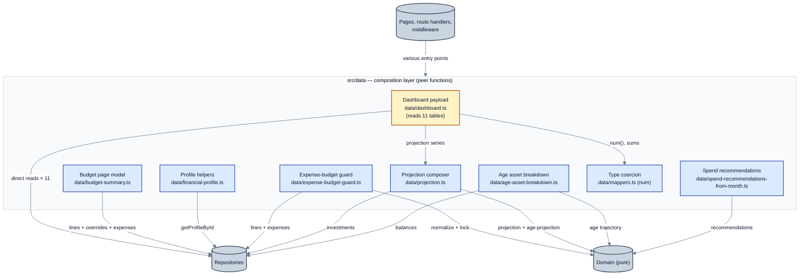

**Sub-component → file map:**

| Sub-component | File |
|---|---|
| Type coercion | `src/data/mappers.ts` (`num`, helpers) |
| Profile helpers | `src/data/financial-profile.ts` (`needsOnboarding`, `isFinancialProfileIncomplete`) |
| Expense-budget guard | `src/data/expense-budget-guard.ts` (`hasBudgetCategoryMonthlyConflict`) |
| Budget page model | `src/data/budget-summary.ts` (`getBudgetPageModel`) |
| Spend recommendations | `src/data/spend-recommendations-from-month.ts` |
| Age asset breakdown | `src/data/age-asset-breakdown.ts` |
| Projection composer | `src/data/projection.ts` (`resolveProjectionSnapshot`, `buildProjectionSeries`, `timeToGoalForTarget`) |
| Dashboard payload | `src/data/dashboard.ts` (`getDashboardPayload` — master aggregator) |

### §4.3.3 Server-action sub-components — `src/server/actions.ts` + advisor action files
<!-- last-verified: 2026-05-13 -->

Server actions live in four files. `src/server/actions.ts` holds the 27 user-data mutations (forms in client/setup/goals features). `src/server/advisor-access-key-actions.ts` keeps the legacy POC key-generation action available but no longer mounted in the primary UI. `src/server/advisor-key-purchase-actions.ts` owns coupon-backed key purchase, advisor phone verification sync, and controlled client advisor-contact lookup. `src/server/advisor-client-actions.ts` owns the advisor edit-on-behalf-of-linked-client mutations, each gated by `requireAdvisorLinkedClient` plus the RLS policies in `supabase/migrations/20260513000000_advisor_linked_client_rls.sql`. All but `signOutAction` share Shape 1 (§2.0): auth check → field validation → repo/RPC call → `revalidatePath` × N → result object. Two intentional gaps documented inline: no `deleteInvestmentAction`, no `deleteGoalAction`.

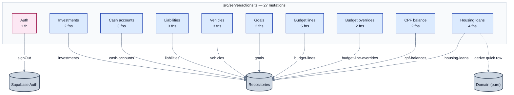

**Entity → action map:**

| Entity | File | Actions |
|---|---|---|
| Auth | `src/server/actions.ts` | `signOutAction` |
| Investments | `src/server/actions.ts` | `createInvestmentAction`, `updateInvestmentAction` _(no delete)_ |
| Cash accounts | `src/server/actions.ts` | `createCashAccountAction`, `updateCashAccountAction`, `deleteCashAccountAction` |
| Liabilities | `src/server/actions.ts` | `createLiabilityAction`, `updateLiabilityAction`, `deleteLiabilityAction` |
| Vehicles | `src/server/actions.ts` | `createVehicleAction`, `updateVehicleAction`, `deleteVehicleAction` |
| Goals | `src/server/actions.ts` | `createGoalAction`, `updateGoalAction` _(no delete)_ |
| Budget lines | `src/server/actions.ts` | `createBudgetLineAction`, `updateBudgetLineAmountAction`, `updateBudgetLineScheduleAction`, `deleteBudgetLineAction`, `applyGuidedBudgetLinesAction` (seeds N lines from `src/domain/finance/budget-guided-setup.ts`; called during onboarding) |
| Budget overrides | `src/server/actions.ts` | `setBudgetMonthOverrideAction`, `clearBudgetMonthOverrideAction` |
| CPF balance | `src/server/actions.ts` | `upsertCpfBalanceAction`, `clearCpfBalanceAction` |
| Housing loans | `src/server/actions.ts` | `createHousingLoanAction`, `createHousingLoanQuickAction`, `updateHousingLoanAction`, `deleteHousingLoanAction` — quick variant uses `src/domain/finance/housing-loan-quick.ts` (`deriveQuickHousingLoanRow`, `HDB_CONCESSIONARY_RATE_ANNUAL`) |
| Advisor access keys | `src/server/advisor-access-key-actions.ts` | `generateAdvisorAccessKeysPocFormAction`, `generateAdvisorAccessKeysPocAction` — advisor-only via `isAdvisor`; tokens from `src/lib/advisor-access-key-token.ts:generateUniqueAdvisorAccessKeys` (POC batch of 10) |
| Advisor purchases/contact | `src/server/advisor-key-purchase-actions.ts` | `validateCouponForPurchaseAction`, `buyAdvisorAccessKeysAction`, `saveAdvisorPhoneForVerificationAction`, `syncAdvisorVerifiedPhoneAction`, `getMyAdvisorContactAction` |
| Advisor edit-on-behalf | `src/server/advisor-client-actions.ts` | `patchAdvisorClientProfileAction`, `patchAdvisorClientBudgetLineAmountAction`, `patchAdvisorClientGoalMonthlyContributionAction` — each gated by `requireAdvisorLinkedClient` + RLS policies from `supabase/migrations/20260513000000_advisor_linked_client_rls.sql` |

### §4.3.4 Repository sub-components — `src/data/repositories/`
<!-- last-verified: 2026-05-13 -->

One file per table or RPC cluster, strict 1:1 mapping where the table is directly read. Each file exports the read functions the app needs (often per-month or per-user) plus the mutation set actually used elsewhere. Note that `cpf-balances.ts` uses `upsert` because its table PK is `user_id`; everything else uses `insert + id`. The advisor repositories include direct table wrappers (`advisor-access-keys.ts`, `advisor-clients.ts`, `advisor-dashboard.ts`, `pricing.ts`, `purchases.ts`) plus `coupons.ts` for the purchase/contact RPC boundary.

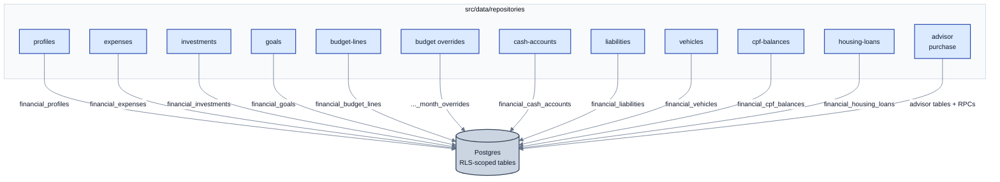

**Repository → file + exports map:**

| Repository | File | Exported functions |
|---|---|---|
| profiles | `src/data/repositories/profiles.ts` | `getProfileById`, `updateProfile` |
| expenses | `src/data/repositories/expenses.ts` | `listExpensesForMonth`, `listExpensesForYear`, `getExpenseById`, `insertExpense`, `updateExpense`, `deleteExpense` |
| investments | `src/data/repositories/investments.ts` | `listInvestments`, `getInvestmentById`, `insertInvestment`, `updateInvestment` _(no delete)_ |
| goals | `src/data/repositories/goals.ts` | `listFinancialGoals`, `insertFinancialGoal`, `insertFinancialGoalsBulk`, `updateFinancialGoal` _(no delete)_ |
| budget-lines | `src/data/repositories/budget-lines.ts` | `listBudgetLines`, `insertBudgetLine`, `updateBudgetLine`, `deleteBudgetLine` |
| budget overrides | `src/data/repositories/budget-line-overrides.ts` | `listBudgetLineOverridesForMonth`, `upsertBudgetLineMonthOverride`, `deleteBudgetLineMonthOverride`, `overridesToLineIdMap` |
| cash-accounts | `src/data/repositories/cash-accounts.ts` | `listCashAccounts`, `insertCashAccount`, `updateCashAccount`, `deleteCashAccount` |
| liabilities | `src/data/repositories/liabilities.ts` | `listLiabilities`, `insertLiability`, `updateLiability`, `deleteLiability` |
| vehicles | `src/data/repositories/vehicles.ts` | `listVehicles`, `insertVehicle`, `updateVehicle`, `deleteVehicle` |
| cpf-balances | `src/data/repositories/cpf-balances.ts` | `getCpfBalanceByUserId`, `upsertCpfBalance`, `deleteCpfBalance` — PK is `user_id` |
| housing-loans | `src/data/repositories/housing-loans.ts` | `listHousingLoans`, `insertHousingLoan`, `updateHousingLoan`, `deleteHousingLoan` |
| advisor-access-keys | `src/data/repositories/advisor-access-keys.ts` | `listAdvisorAccessKeysForAdvisor`, `countAdvisorAccessKeyStatuses`, `insertAdvisorAccessKeys` — wraps `advisor_access_keys` |
| advisor-clients | `src/data/repositories/advisor-clients.ts` | `listClientsForAdvisor`, `getClientProfileForAdvisor` — reads `financial_profiles` via cross-advisor SELECT policy |
| advisor-dashboard | `src/data/repositories/advisor-dashboard.ts` | `getAdvisorDashboardData` — aggregator for `/advisor` home (clients + key snapshot) |
| pricing | `src/data/repositories/pricing.ts` | `ACCESS_KEY_PRODUCT_CODE`, `getPricingByProductCode` — reads `pricing` product `0001` |
| purchases | `src/data/repositories/purchases.ts` | `listPurchasesForAdvisor` — advisor-owned purchase history |
| coupons | `src/data/repositories/coupons.ts` | `validateCouponForPurchase`, `fulfillAccessKeyPurchase`, `getMyAdvisorContact` — typed wrappers for security-definer RPCs |

---

## Appendix — Cross-references
<!-- last-verified: 2026-05-13 -->

- **Product / business scope:** `README.md`
- **Living product/route/data summary:** `PROJECT_CONTEXT.md` — updated whenever a user-facing feature, route, data model, or cross-cutting behavior changes. The handbook is the architectural reference; `PROJECT_CONTEXT.md` is the narrative companion.
- **Project conventions for AI contributors:** `AGENTS.md`
- **Decision history:** `docs/adr/`
- **Reference validation:** `npm run docs:check` (script: `scripts/validate-handbook.mjs`)
- **Function-level view:** `docs/function-tree/index.md` (generated by `scripts/function-tree/`, regenerated via `npm run map`, freshness checked via `npm run map:check`)
- **Advisor / access-key migrations:** `supabase/migrations/20260512000000_advisor_client_access_keys.sql`, `supabase/migrations/20260512000001_advisor_skip_onboarding.sql`, `supabase/migrations/20260512000002_advisor_select_linked_clients.sql`, `supabase/migrations/20260513000000_advisor_linked_client_rls.sql`, `supabase/migrations/20260517100000_advisor_key_purchases_coupons_contact.sql`
